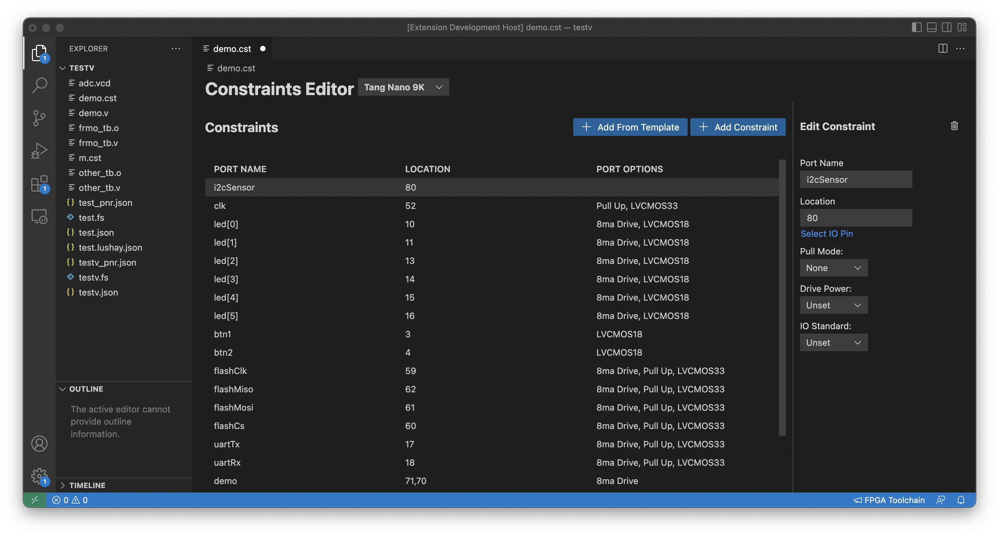
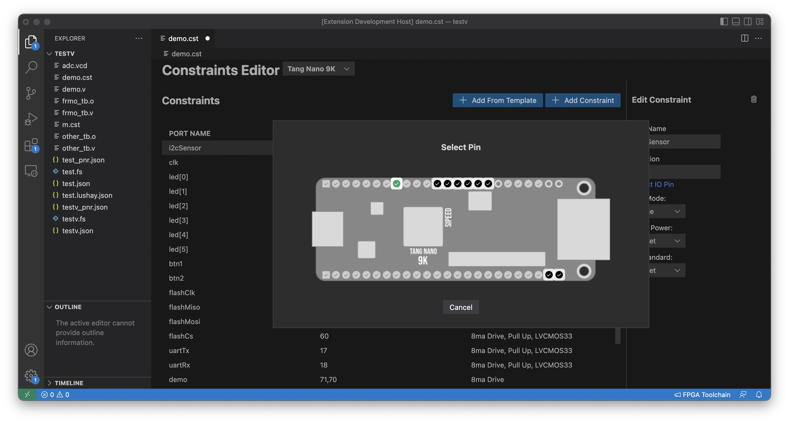

# Lushay Code README

This is the README for the Lushay Code extensions for VSCode.

## Features

This extension automates the execution of the open source FPGA toolchain. 
This project is a wrapper around OSS-CAD-Suite which does the heavy lifting of providing all the prebuilt binaries for the OS toolchain.

Currently only the following boards are supported:
- Tang Nano 9K
- Tang Nano 4K
- Tang Nano 1K
- Tang Nano
- icebreaker
- icestick
- Orange Crab

Support for other FPGAs is planned and welcomed.

Features Include:
- Building Project (yosys + nextpnr + apicula / trelis / icestorm)
- Programming (openFPGALoader)
- Serial Console for UART communication
- Terminal pre-configured with OSS-CAD-Suite
- Visual constraints editor
- Verilog Linting (using verilator)
- Cloud Builds

## Requirements

To use this plugin you have to have OSS-CAD-Suite on your computer. For linux and mac you just need to extract the compressed folder for your OS to anywhere on your computer
For windows you download an executable which will extract the data for you.
OSS-CAD-Suite can be downloaded from [here](https://github.com/YosysHQ/oss-cad-suite-build/releases)

There is also a link from within the extension which will appear once running the extension to download OSS-CAD-Suite.

> There is an issue when the path or folder to oss-cad-suite contains spaces, to be safe you can for example put it at the root of your drive and name it "oss-cad-suite" without spaces

## Getting Started
To get started you need to open a new folder and have at least 1 verilog file (`.v`) and 1 constraints file (`.cst` / `.lpf` / `.pcf`). With these two files created you can press the "FPGA Toolchain" button on the right side of the bottom bar.

If you have not yet linked OSS-Cad-Suite you will get a popup message with a button where you can link the oss-cad-suite folder. Simply select the extracted folder called oss-cad-suite and then you can reclick on the "FPGA Toolchain" button.

Once setup clicking this button will open a dropdown with multiple options like building the project, programming the FPGA device and so-on.

By default all verilog files in the current project except those ending with `_tb.v` (which are considered test benches) will be built and you should have a top module called `top`.

If you have a testbench file you will also get an option to run the testbench. The testbench top module needs to be called `test`.

By default a project with a `.cst` file will use project apicula, `.lpf` will use project icestorm and `.pcf` will use project trelis but this can be overwritten by setting the `board` option in your project file.

### CST Editor

When opening a .cst / .pcf or .lpf file it will open by default with the visual constraints editor. Here you have a table with the current constraints and two main buttons "Add Constraint" and "Add From Template". The "Add From Template" button is to easily add constraints for built in hardware on the development board, things like LEDs, buttons, Flash IC, etc. The "Add Constraint" is to add a new custom constraint. When you add a new constraint (via either method) you will see it show up in the table as a row. You can click on any row to edit it in the side panel.

 

You can edit the name, location and other options on the constraint. For location you can either enter the pin number if you know it, or press the "Select IO Pin" to visually select the pin from the board.



Both the "Select IO Pin" and "Add From Template" are board specific so you have to choose the correct board from the dropdown at the top.

If you prefer to edit your constraints files manually using a text editor you can right click on the file and press "Open With". This will open a dropdown with options and there is even an option to set the default editor so it will always use your preference in the future.

### Linting
For linting to be enabled you need to have your project chosen in the bottom bar since the linter needs to know which files are included in the build to properly lint. There is a button next to the "FPGA Toolchain" button which by default says `<Auto-Detect Project>`. You can click this button to select your project file which will enable linting. If your workspace has no project file (`.lushay.json` file) then linting will also be enabled automatically and it will include all verilog files in the current workspace.

## Configuration
You can override the default behaviour of the extension by creating a file called `<name>.lushay.json` for example `demo.lushay.json` with overrides for all the settings. The name can be whatever you want and it will be used as the default output name so in this example if I would compile the code I would get a file called `demo.fs`.

The type of the configuration file is as follows:
```
export interface ProjectFile {
    name: string;
    includedFiles: string[] | 'all';
    externalFlashFiles: string[];
    top: string;
    constraintsFile: string;
    programMode: 'flash' | 'ram';
    testBenches: string[] | 'all';
    nextPnrGowinOptions: string[];
    synthGowinOptions: string[];
    baudRate: number;
    board: string;
    skipCstChecking: boolean;
}
```

All fields are option and have default values as detailed below

| Key | Description | Default |
| ------------- | ------------- | ------------- |
| name  | Overrides the project name | Either the project file's name or the folder name |
| includedFiles | The verilog files to synthesize | all which means all non testbench verilog files you can also specify file paths relative to the project file |
| externalFlashFiles | Binary files to flash to the external flash | [] |
| top | The name of the top module for synthesis | top |
| constraintsFile | Path to constraints file relative to project file | finds first constraint file in directory |
| programMode | Whether to program to flash or ram | flash |
| testBenches | Paths to test benches relative to project file | all which means all `_tb.v` files |
| nextPnrGowinOptions | Extra flags for the nextpnr-gowin stage | [] |
| synthGowinOptions | Extra flags for the synth-gowin stage in yosys | [] |
| baudRate | Baud Rate for serial console | 115200 |
| board | The FPGA board being used | tangnano9k |
| skipCstChecking | Skip the prestage of making sure all ports are defined | false |

values for board are:
- tangnano20k
- tangnano9k
- tangnano4k
- tangnano1k
- tangnano
- icebreaker
- icestick
- orangeCrab

### Ubuntu USB Setup
On Ubuntu by default users don't have the required permissions that openFPGALoader needs in-order to function. To fix this you can open up a terminal and run the following to give your user the required permission.

```sh
curl -sSL https://raw.githubusercontent.com/lushaylabs/openfpgaloader-ubuntufix/main/setup.sh | sh
```

After running this you need to unplug and replug in your FPGA board and also logout and log back in to you user for the changes to take effect then openFPGALoader should work

### Windows Driver Setup

On windows the default driver for the JTAG interface does not work with openFPGALoader. To fix this you need to change the driver of this interface, this can be done with a tool called [Zadig](https://zadig.akeo.ie/)

Download the tool and then open it, once open you need to select "Options" > "List All Devices" from the top menu to show all connected usb devices. Next in the dropdown you should see two devices:

1. JTAG Debugger (Interface 0)
2. JTAG Debugger (Interface 1)

Interface 0 is the JTAG interface openFPGALoader needs to program the Tang Nano while Interface 1 is the serial interface used for the UART communication. It is important to leave interface 1 as-is and only replace interface 0 here.

So select "JTAG Debugger (Interface 0)" and underneath you should see it show that it will change the driver to "WinUSB" if WinUSB is not selected you can use the up/down arrows to select it.

Once selected just the replace driver button and wait a minute or two, once done it should work in openFPGALoader.

If you ever want to uninstall this driver and go back to the default driver (for example to use the official gowin IDE) all you have to do is go to "Device Manager" select the device called "JTAG Debugger" under "Universal Serial Bus devices" right-click on it and press "uninstall device" from the popup also select the checkbox to attempt to remove the driver. Once removed right click on any item in the device manager window and press "Scan for hardware changes" this should reconnect the device back with the original driver.

## Cloud Builds
Cloud builds use our servers to synthesize and generate the bitsream for your project. Currently this is only supported for tang nano boards and the cloud will use the official Gowin EDA (educational edition) to synthesize your bitstream. This allows you to use features not yet covered by the open source toolchain / to compare the results from the opensource toolchain to the official toolchain.

This option still requires OSS-CAD-Suite to be setup as it is used for preparing the files for the cloud build.

To setup cloud builds you need to go to the extension settings for the Lushay Code extension. You can get there in VSCode by going to the extensions tab and clicking on the Lushay Code extension and then from the Cog-wheel you can select "Extension Settings". Alternatively you can go directly to the settings and search for "lushay" to filter all the settings to only the relevent ones.

With the settings open you can select "cloud" as your prefered toolchain, and you must enter an API key for the cloud service. You can recieve an API key by signing up for our Cloud service [here](https://lushay-code.lushaylabs.com/).

With the settings configured you can then build your project regularly using the "FPGA Toolchain" button and instead of using the local toolchain it will build the bitstream remotely.

## Extension Settings

This extension contributes the following settings:

* `lushay.OssCadSuite.path`: You need to set this to the path of OSS-CAD-Suite on your computer
* `lushay.Build.toolchain`: This can be set to 'open-source' or 'cloud' to choose the desired toolchain
* `"lushay.Build.cloudApiKey`: If cloud is selected this setting must contain a valid API key

## Release Notes

Check CHANGELOG for updates

**Enjoy!**
